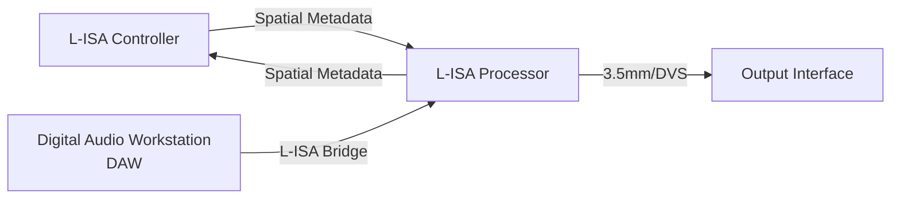

# L-ISA Guide

Today I will be showing how to setup L-ISA controller and processor.

Resources

* L-ISA Controller
* L-ISA Processor
* Reaper(x64)
* loopMIDI

# System Flowchart

# Configuration (L-ISA)
1. Open L-ISA Processor and select your heaphone/speaker output

2. Open L-ISA Controller and go to Processors, select and connect to your local processor desktop, and check connection and audio status

3.Hit Play in Reaper