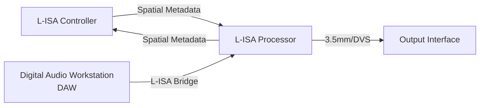

# L-ISA Guide

Today I will be showing how to setup L-ISA controller and processor.

```mermaid
graph LR
A[L-ISA Controller] --Spatial Metadata--> B[L-ISA Processor]
B --Spatial Metadata--> A
C[Digital Audio Workstation<br>DAW] --L-ISA Bridge--> B
B --3.5mm/DVS--> D[Output Interface]
```

# Configuration (L-ISA)
1.Open L-ISA Processor and select your heaphone output

