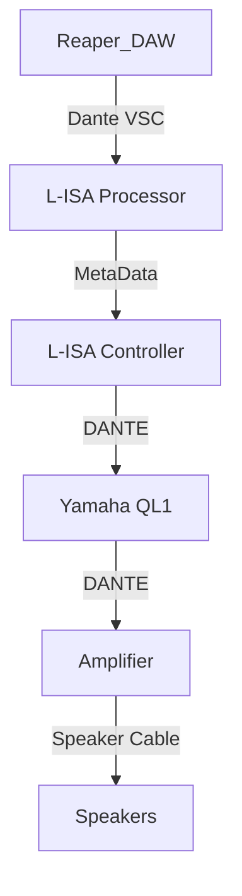

In this document, you will get to know how to link **Reaper, L-ISA Controller and L-ISA Processor** for a Surround Sound Game.

# Software Used

* Reaper(x64)
* loopMIDI
* L-ISA Controller
* L-ISA Processor

In this document, it will be seperated into 2 parts:

1. Reaper For MIDI Timecode - Click [Here](./Reaper.md)
2. L-ISA Controller and Processor - Click [Here](./L-ISA.md)

# System Diagram
