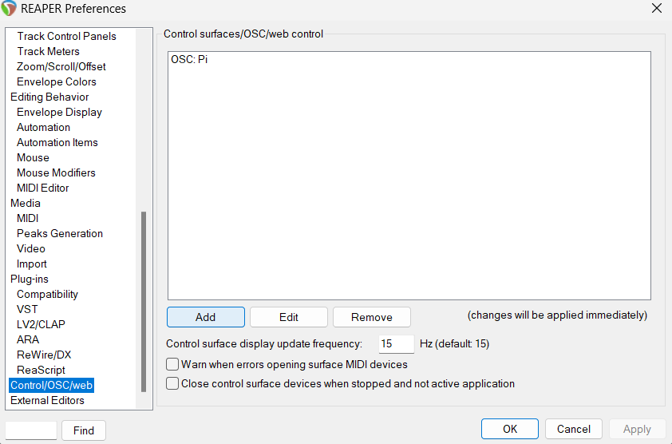

# Reaper(x64) Guide

Today I will show you on how to run **Reaper** for MIDI timecode for **L-ISA Controller** followed by Using Raspi to control **Reaper**.

# Resources
* L-ISA Controller
* L-ISA Processor
* Reaper(x64)
* loopMIDI

# System Flowchart

# Configuration (Setup MIDI Timecode)
1. Open **loopMIDI** and create a new virtual port by pressing the plus(+) sign after renaming the port to the name of your choice.

2. Open **Reaper** and create a new project

3. Go to insert and select SMPTE LTC/MTC Timecode Generator and the timecode generator will appear on the timelime selected

4. After the timecode generator appear, right click on the timecode generator and select source properties

5. On the SMPTE Generator Properties, select Send MIDI(MTC) to send MIDI Timecode and select Ok to save the settings

6. Open **Reaper preferences** (Ctrl + P), Go to Audio > MIDI Devices, select the loopMIDI port in the MIDI output list
* If it is not enabled, right-click on it and select "Enable Output" 

7. Also in **Reaper preferences**, Reaper must be inform of which file to recieve L-ISA plug-ins folder

* Select **VST** in the list
* Enter the path to the folder where L-ISA plug-ins are installed, like c: :\Program Files\L-Acoustics\L-ISA Controller\VST3\
* Hit Rescan

8. Also in **Reaper Preferences**, select **L-ISA audio bridge** as an audio device
* Select **ASIO** First

9. In Reaper,click on the **Route** button of timecode generator track in the **Mixer** to open the routing panel of the MIDI TimeCode Track and select the **loopMIDI** port in the MIDI Hardware Output list

10. In the **L-ISA Controller**, go to **Settings > MIDI** and select on **MTC** from loopMIDI Port as the MIDI Interface
* In **Reaper**, hit Play and Verify that the timecode is recieved in the **L-ISA Controller** with the right frame rate and timing

# Configuration (Reaper for OSC)

1. Go to **Reaper References** (Ctrl+P)
2. Navigate to **Control/OSC/Web**
3. Click on ADD to configure a new OSC device

4. Configure new OSC Device

