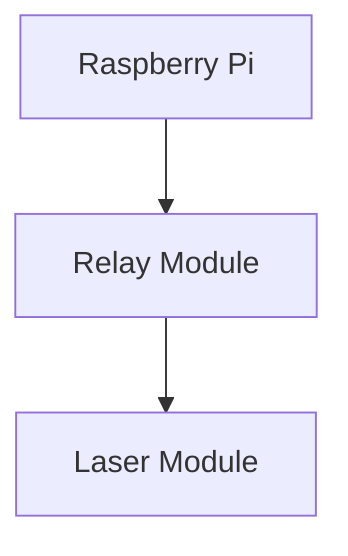
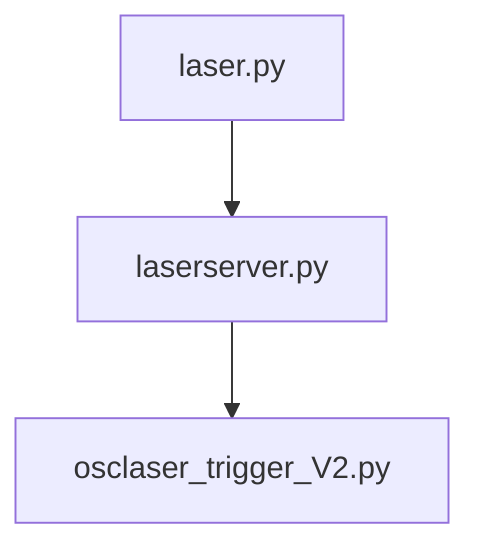

# Welcome to the Laser Light Show Repository

## Overview

Welcome to the Laser Light Show repository! Here, you'll find everything you need to set up and execute an incredible laser light show using Raspberry Pi. This guide covers hardware requirements, connection details, software setup, and descriptions of the main files used in the project.

## Hardware

### Requirements
- Raspberry Pi 4
- Relay Module
- Laser Module
- Dupont Wires
- Laptop (optional)

### Connections

**System Diagram:**




Connections for All Components:

- **Raspberry Pi to Relay Module:** Connect GPIO pins on the Raspberry Pi to the inputs on the relay module using Dupont wires.
- **Relay Module to Laser Module:** Link the relay module outputs to the laser module inputs with Dupont wires.
- [Link to Connection Diagram Image]

## Software

### Setting Up

**Update Your Raspberry Pi:**
Keep your Raspberry Pi up-to-date by running the following commands in the terminal:
```bash
sudo apt update
sudo apt upgrade
```
If the update or upgrade fails, manually set the date and time:

```bash
sudo date -s 'YYYY-MM-DD HH:MM:SS'
```

### Setting Up a Virtual Environment

**Install the virtual environment package:**

```bash
sudo apt install virtualenv python3-virtualenv -y
```

**Create a new virtual environment:**

```bash
virtualenv -p /usr/bin/python3 <environment_name>
```

**To activate the virtual environment:**

```bash
source myenv/bin/activate
```
**Install packages within the virtual environment using pip:**

```bash
pip3 install <package_name>
```

**When finished, deactivate the virtual environment:**

```bash
deactivate
```
### Main Files

- **osclaser_trigger_V2.py**
- **laserserver.py**
- **laser.py**
- **reaper.py**

**System Diagram:**



### File Descriptions

- **osclaser_trigger_V2.py:** This script is responsible for activating the lasers. The Master Pi uses this script to control which lasers fire and when, based on the live show’s settings.

- **laserserver.py:** This script handles communication with the slave devices, instructing them when to turn lasers on or off and which specific lasers to activate.

- **reaper.py:** Manages OSC communication between devices, including the Master Pi, Slave Pi, and optionally, the Laptop.

- **laser.py:** This script runs on your laptop and orchestrates the light show. It sends commands to the Master Pi, which then controls the lasers according to the show’s timing and sequence.

Feel free to copy and adjust as needed!


