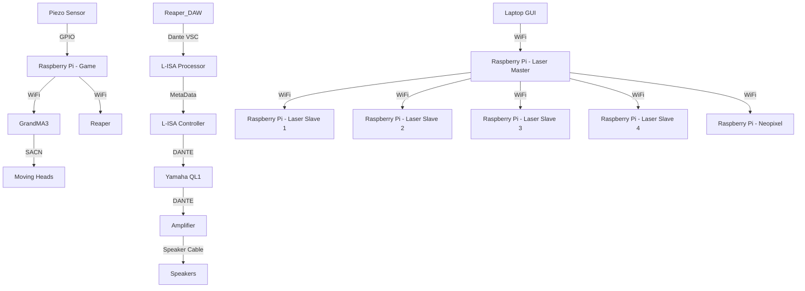

# Minimum Viable Product

## Description
Welcome to Team F's Game Showcase featuring **The Range**. This repository includes all necessary codes, lighting assets, and video assets used throughout the project. This document will provide an overview of the game, its functionalities, and how the system components are integrated.

## Overview
**The Range** is an interactive game designed to challenge players with a series of timed cues. The game involves hitting targets on various boards, with the time to hit each cue decreasing as the stages progress. Each board and stage is monitored through a complex system involving multiple Raspberry Pis, sensors, and integration with various audio and lighting controls.

## System Diagram

# The Range Game Setup

This repository provides a comprehensive guide on setting up and running **The Range** game using your Raspberry Pi.

## Hardware Requirements

- Raspberry Pi 4
- Piezo sensor
- Boards
- Dupont wires

## Setting Up Sensors

Follow the installation guide and instructions for setting up the sensors in the [Sensors folder](https://github.com/gio0oO/EGL314_Team-F_Project-Repository/tree/main/MVP/GameFiles/Sensors).

## Running the Game

Installation guide for the software and instructions for running the game can be found in the [Game Code folder](https://github.com/gio0oO/EGL314_Team-F_Project-Repository/tree/main/MVP/GameFiles/Game%20Codes).

## Example Setup

Here is an example of how we set up our station:

Here are the projectiles we used (Shurikens) and the holder we made for them:

Here is how we placed and protected our Raspberry Pi

