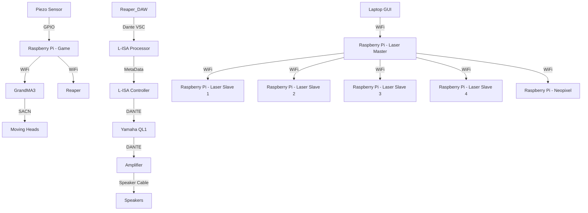

# Welcome to the S.O.N.I.C Game Station 1 Documentation!

We are Team F from the MTS 2024 Batch, and this repository provides comprehensive documentation for our project, S.O.N.I.C Game Station 1. Here, you'll find detailed instructions for installations, Raspberry Pi code, and operation procedures.

## About Our Project

S.O.N.I.C Game Station 1 is an interactive target practice game. Players aim to hit targets with shurikens based on directional audio cues. When a sound originates from a specific target, that target becomes the player's focus. The game features three rounds, with decreasing time to hit the targets, increasing the challenge and excitement.

### Game Rules

1. **Three Rounds**: The game consists of three rounds, each with progressively less time to hit the targets.
2. **Targets**: There are three targets – left, right, and center – each represented by a board.
3. **Weapon**: Players use shurikens to hit the targets.
4. **Audio Cues**: Directional audio cues indicate which target to aim for. A sound from a specific direction signals the corresponding target.

Good luck, and aim well!

# System Diagram

## Contributors

- **gio0oO**
- **samisbackagain05**
- **Genwei1811**

These individuals have committed to this repository and contributed to the development of S.O.N.I.C Game Station 1.