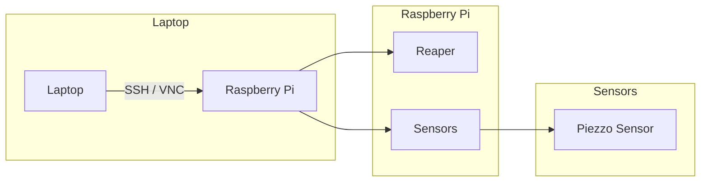

# Raspberry Pi Programming Documentation

This file contains the steps of how to run the station from the coding side. We used Python on our Raspberry Pi 4 to achieve this.

## Hardware Requirements
- Laptop (Optional)
- Raspberry Pi 4
- Jumper Wires
- Piezzo Sensor
- Board

## Software Requirements
- VNC Viewer (Optional)
- Python
- Reaper
- grandMA3

## System Diagram


## Setup Instructions

### Hardware Setup
1. Connect the **Piezzo Sensor** to the Raspberry Pi GPIO pins using jumper wires.
2. Connect the **Board** to the Raspberry Pi GPIO pins using jumper wires.
3. Ensure all connections are secure and correct as per the sensor specifications.

### Software Setup
1. **Install Python**:
   - Python should be pre-installed on Raspberry Pi OS. Verify the installation by running:
     \```bash
     python --version
     \```
   - If Python is not installed, install it using:
     \```bash
     sudo apt-get update
     sudo apt-get install python3
     \```

2. **Install VNC Viewer** (Optional):
   - Follow the instructions on the [VNC Viewer website](https://www.realvnc.com/en/connect/download/viewer/) to install VNC Viewer on your laptop.
   - Enable VNC on your Raspberry Pi by running:
     \```bash
     sudo raspi-config
     \```
   - Navigate to `Interfacing Options` -> `VNC` and enable it.

3. **Install Reaper**:
   - Download and install Reaper from the [official website](https://www.reaper.fm/download.php).

4. **Install grandMA3**:
   - Install grandMA3 software on your system following the instructions provided by the official source.

### File Setup
1. **Connect to the Raspberry Pi**:
   - If using a laptop, connect to the Raspberry Pi via SSH or VNC Viewer.

2. **Create Project Folders**:
   - On your Raspberry Pi, create three folders named `Reaper`, `Sensors`, and `grandMA3`:
     \```bash
     mkdir ~/Reaper ~/Sensors ~/grandMA3
     \```

3. **Copy Code Files**:
   - Copy and paste the code files from the respective folders on GitHub (labelled "Reaper", "Sensors", and "grandMA3") into the corresponding directories on your Raspberry Pi.

4. **Establish OSC Connection**:
   - Configure an OSC (Open Sound Control) connection between your Raspberry Pi and both Reaper and grandMA3 following their respective OSC documentation.

### Running the Project
1. Connect your sensors to the GPIO pins of your Raspberry Pi according to your wiring plan.
2. Attach Piezzo Sensors to the Board.
3. In the `Reaper` folder, run `Main_Gui.py` to have control of the start game, grandMA3 sequences, and Reaper.
4. After that, click start and enjoy the game! Ensure that the path of the files called is correct.
