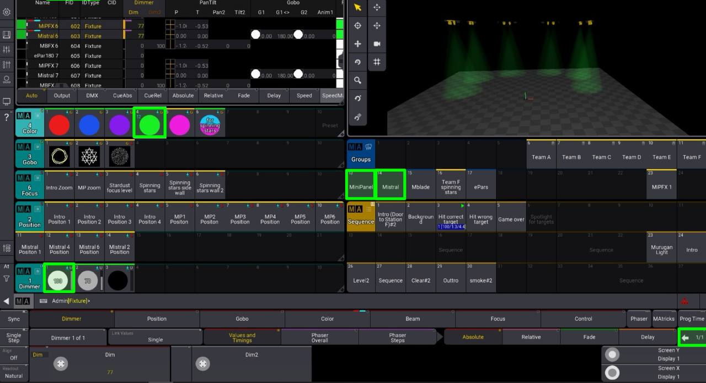

## Background Light Show 
To create this light show, I used all Mini Panels to shine them at different parts of the wall to create a pink, calm ambience accompanied with Japanese Zen music. 

 
I also added 3 Mistrals the shines blue beams of light to the Left, Center and Right Wall of the Classroom, with Gobos of "Nested Triangle" Preset.The specific Mistrals i used are ID203, ID403 and ID603.   

 
