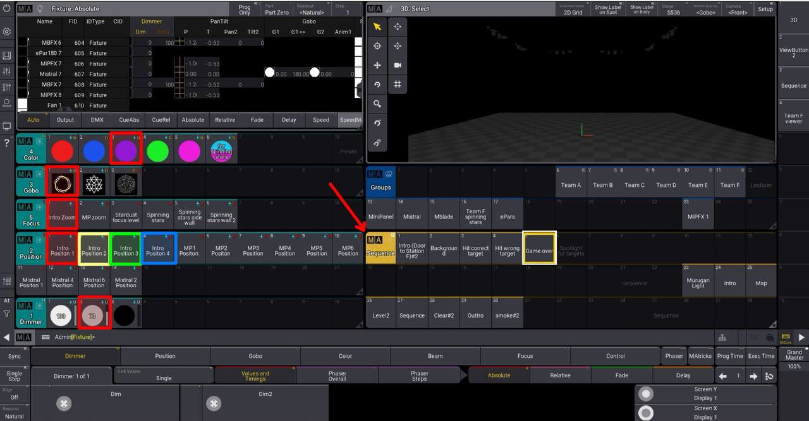
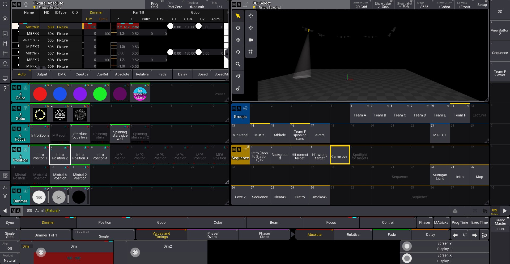
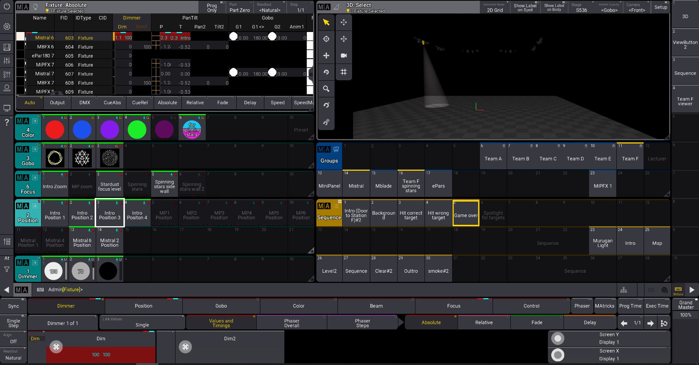
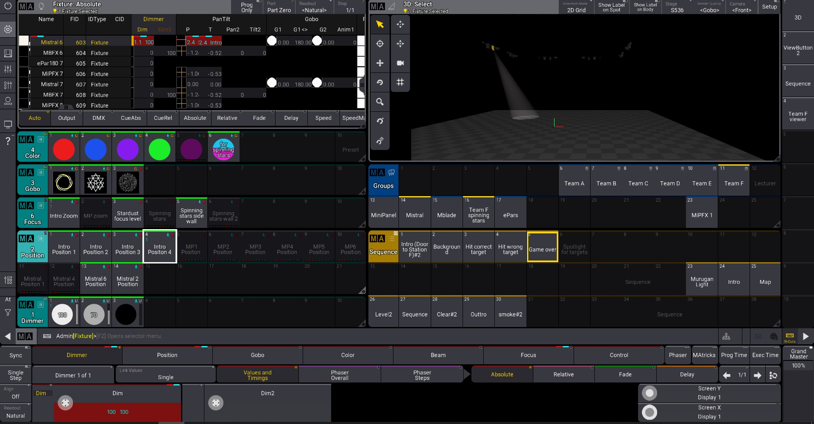

## Intro Lightshow 
The purpose of the Light Showcase is to guide participants to the station from the entrance of S536. Below shows a screenshot of the window i have prepared to create this showcase. 

 
To create a spotlight that leads the participant from the entrance to the front of Station F, the first step is to create midpoints of the pathway. One point can be at the entrance, some in the middle of the path and one at the front of Station F.All positions have the same presets but different positions so repeats the same steps but change the position in order starting from red to blue. Below are some images (not accurate) to illustrate what i have mentioned above. 

 

 

 

 
To make the spotlight or in this case the Mistral move smoothly along the path you have created, we will use MA-tricks. MA-tricks is a tool that helps to combine our different cues into a sequence, making the spotlight travel from the different positions you have created previously, seamlessly. 

In each step,select the positions in a chronological order with the respective focus settings, colour, Gobo and dimmer Level.
