# grandMA3 LightShow Documentation
This file contains the steps of how we created the different light shows for <b>Intro</b>, <b>win</b>, <b>lose</b> and <b>lose a health</b> audio cues.
Do note that these LightShows are only compatible with the current layout of lighting fixtures in S536.

## Hardware
1. Laptop
2. LAN cable
3. USB Cable

## Software (Windows)
1. grandMA3 software (onPC 1.9.7.0)

## System Diagram
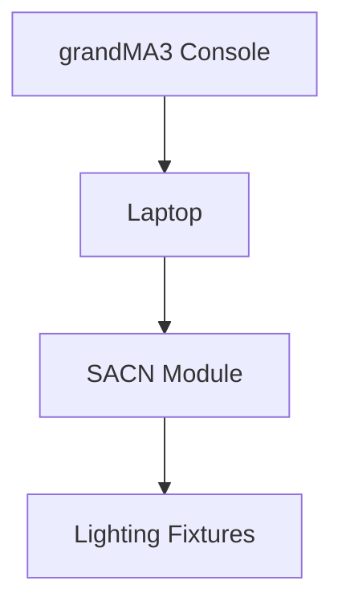

## Setup for SACN Connection
Before moving to software configuration, ensure that a LAN cable is connected between the laptop and the SACN Module of the light fixtures and also a USB Cable to connect the MA3 Console to the Laptop as it is not....

First click on the settings button that can be found in the left hand column of the screen. Once it is clicked upon, a pop up window will appear as shown below.   
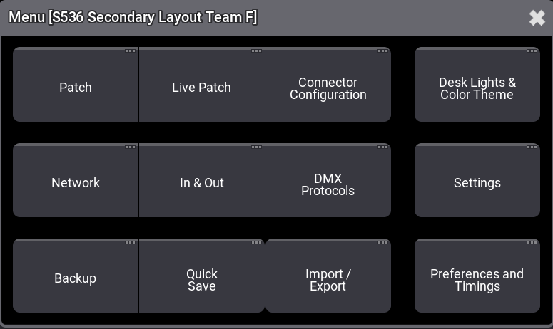

Click on <b>Network</b> first to ensure that the network is online as shown as below:  
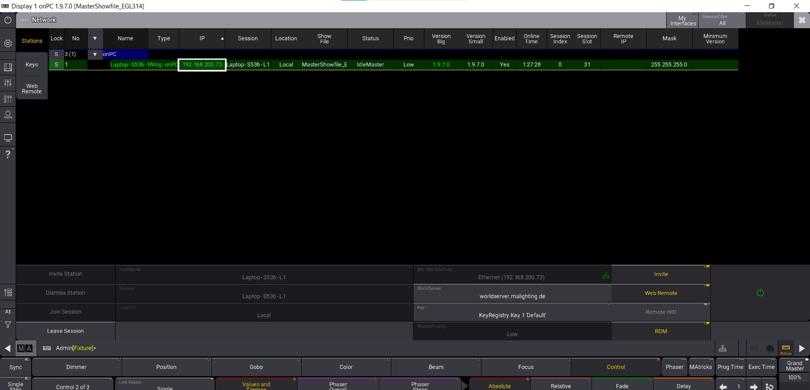

Close the <b>Network Page</b> and then open <b>DMX Protocols</b> to configure your SACN Connection Settings. Under <b>Preferred IP</b>, ensure that the IP address is <b>192.168.200.73</b> and that the options for <b>Enable Output</b> and <b>Interface</b> is selected. Once you have configured these settings, you have successfully connected the console to the light fixtures of S536.

## Patching of Lighting Fixtures
It is important that we first patch the lighting fixtures we have in S536. In S536, we have a total of 24 fixtures excluding the Lecturer's hoist to patch. Each group has 4 fixtures each, one ePAR 180, one MiPFX 1, one Mistral 1 and one MBFX 1. Each Group has its own universe for its fixtures to connect to. Group A connects to Universe 1, Group B to Universe 2 and it continues to Team F. To patch the lights, select <b>settings</b> and click <b>Patch</b>.  
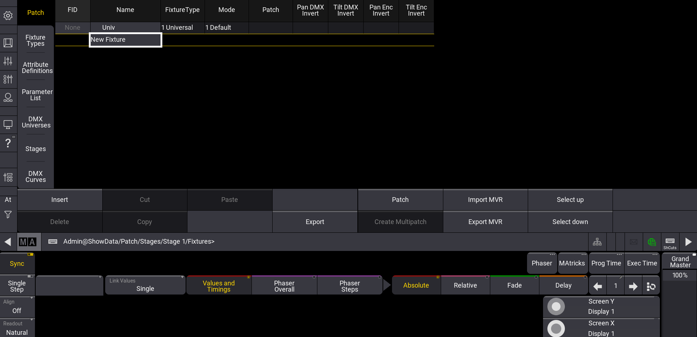
 
Select <b>Insert</b> and search up the fixtures needed to be patched. Ensure that all fixtures are of the same <b>type</b>, <b>mode</b> and are in their respective <b>DMX Channel</b> and <b>Universes</b> as shown below:  
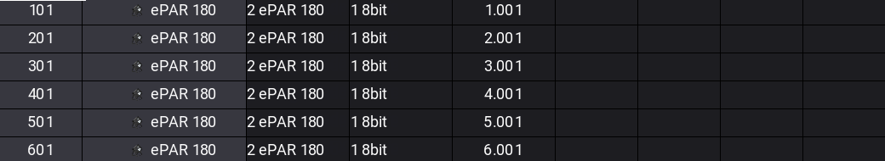  
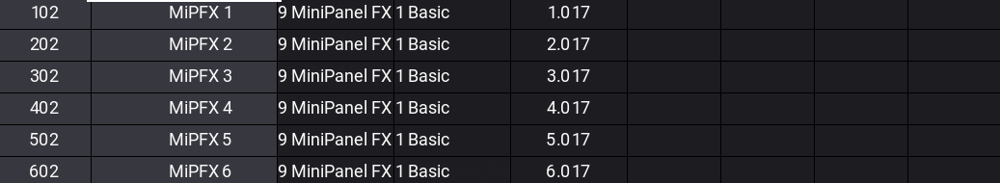  
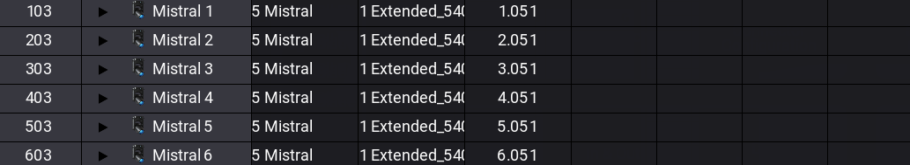  
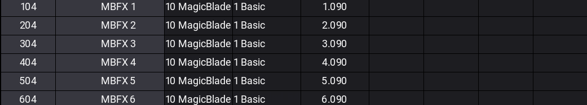  
Once all has been configured, you can leave the <b>Patch</b> window by pressing <b>Save and Exit</b>.

## Setting Up MA3 Windows
To create Mini Windows of tools that you would need, you just need to hold left click of your mouse or trackpad and draw a desired area of how big you want it to be. After you let go of the left click, a pop up window will appear showing you a lost of tools that you can use as show below:  
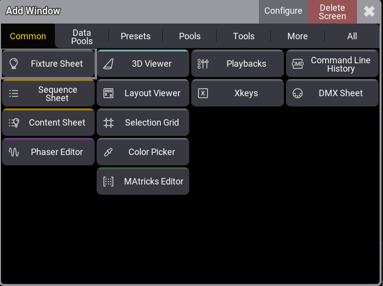
 
We have to create 2 Pages in total; "3D Viewer" and "Color Picker".
In the first page, create windows of <b>Fixture Sheet</b> and <b>3D viewer</b> that can be found under the <b>Common</b> tab of the Tools Pop-out window.  
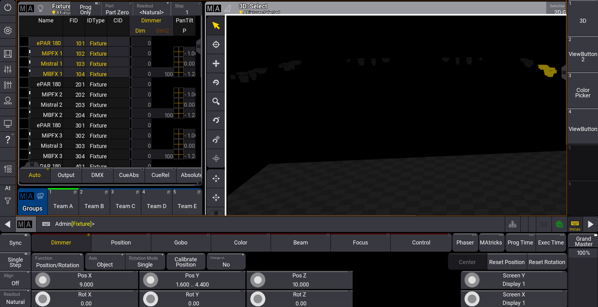
 
The <b>Fixture Sheet</b> shows the fixtures you have patched and you can select on a particular fixture from the fixture sheet and it will be highlighted yellow on the 3D Viewer window. You can also add in a <b>Groups</b> mini window to group the different team fixtures for your own convenience. This tool can be found under the <b>Presets</b> tab. After creating the windows, <b>Crtl + S</b> and right click on a empty square grid at the right hand column of the page to save the screen. Long Right click the grid again to rename it to <b>"3D Viewer"</b>.

For the second page, create windows for <b>Color Picker</b>, <b>Color</b>, <b>Gobo</b>, <b>Sequence</b> and <b>3D Viewer</b>. 
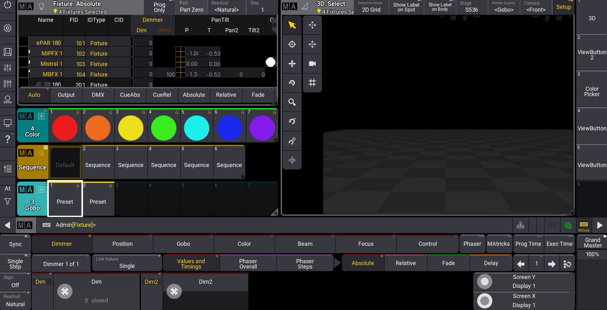
 
Store the different colors and Gobo presets you want into the the grids of the respective tool windows and save the screen under <b>"Color Picker"</b>.To store the different presets, click the the desired preset, the <b>Store</b> button on the console and then the grid you want to place it in.

