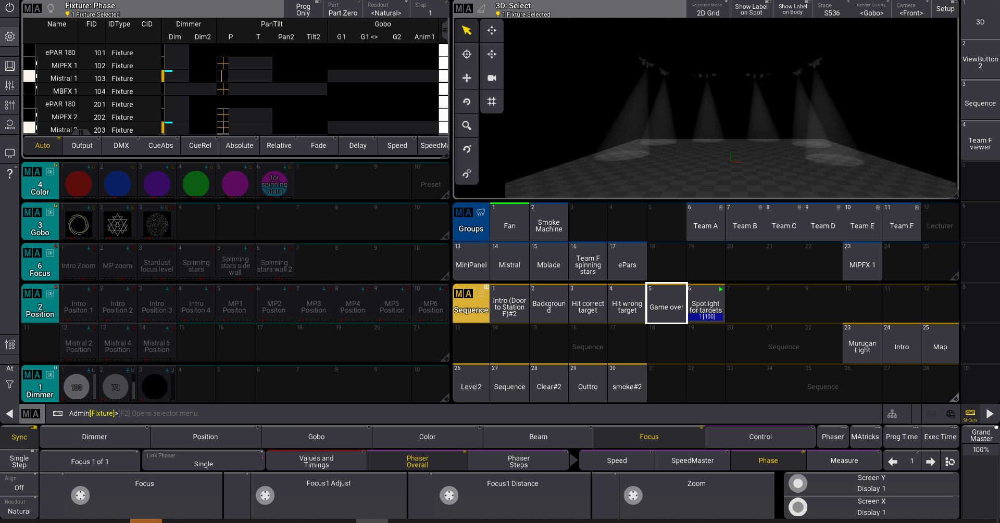

## Spotlight Light Show
The purpose of creating this file is to show the player where the targets are since they would be playing in the dark classroom. 
 
The Mistrals are panned and tilted towards the different spots where the targets will be placed. 
Not only will it visually aid the players in game, but it also acts as markers for us to place the targets when we set up the station.

